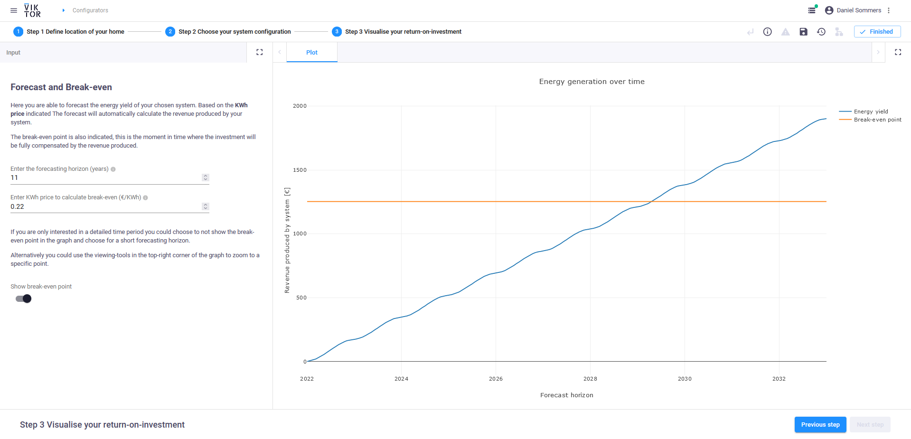

 <Please check version is the same as specified in requirements.txt>

# Solar panel configurator

This sample app shows how to design a home PV-system and calculate its yield.

The goal of this sample app is to show how a super easy to use app looks like. 
Concepts like Steps, descriptions and markdown text is present to guide a user.
This app also interacts with external databases for component information and weather data.

**Step 1: Define home location**


**Step 2: Choose system configuration**


**Step 3: Visualise ROI**



## App structure 

```
Solar panel          
```
