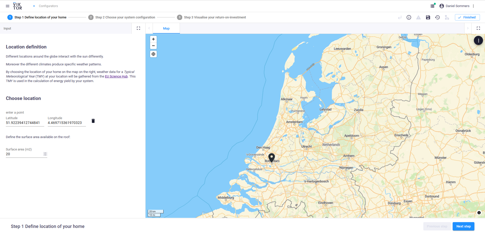
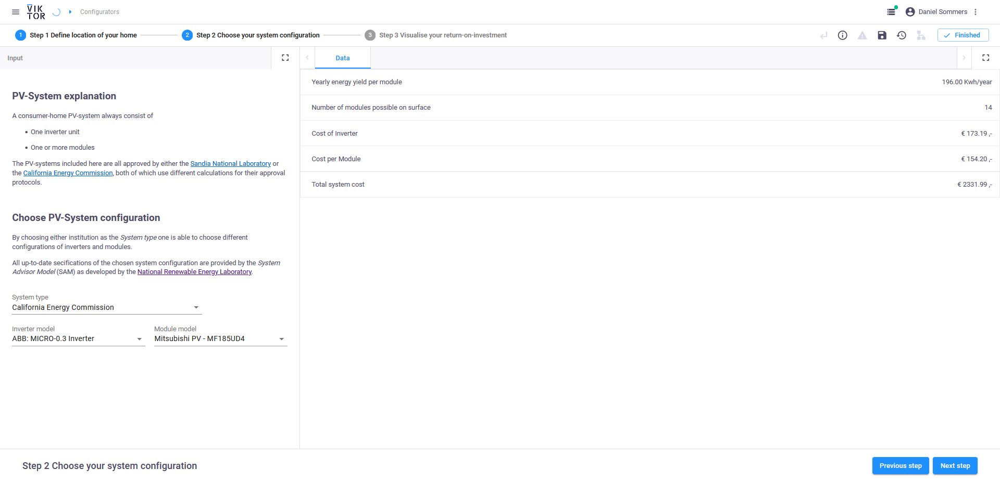
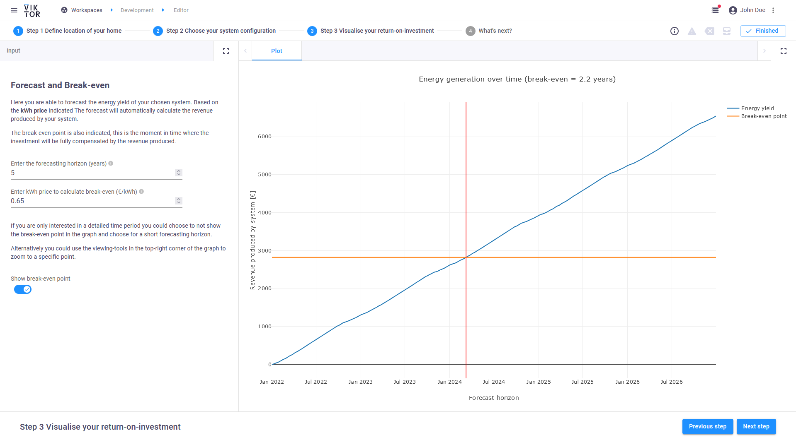
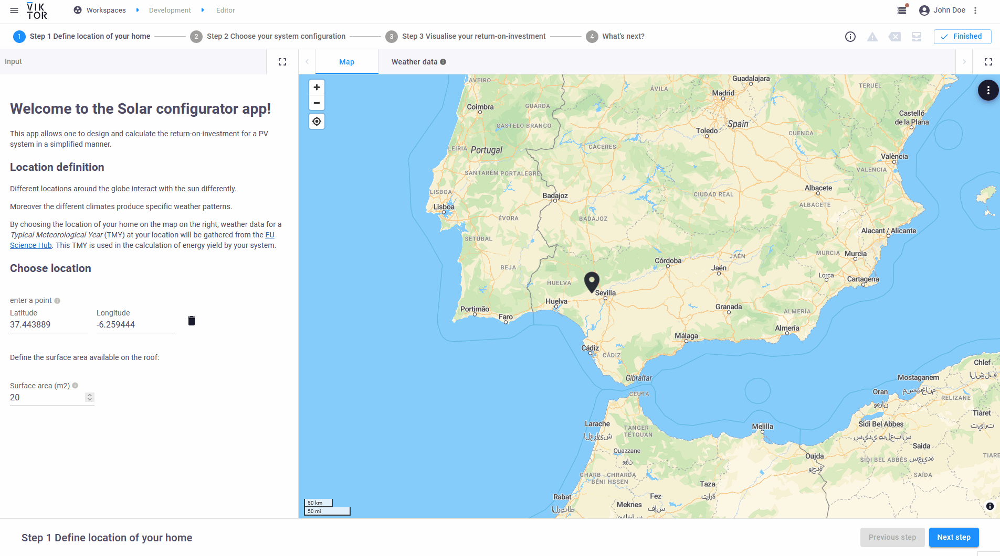

 <Please check version is the same as specified in requirements.txt>

# Solar panel configurator

This sample app shows how to design a home PV-system and calculate its yield.

The goal of this app is to demonstrate how the VIKTOR platform can be used in the renewable energy industry, as well as
 to demonstrate how a platform like VIKTOR can leverage community supported developments to accelerate the pace of 
developments and innovation. This app was developed on top of an open-source python library (`pvlib`) that provides a 
set of functions and classes for simulating the performance of photovoltaic energy systems.

With the VIKTOR platform the development is made accessible to a larger audience through a user-friendly web 
interface.

A published version of this app is available on [demo.viktor.ai](https://demo.viktor.ai/workspaces/10/app/).

### Step 1: Define home location

By selecting the location, the relevant weather and solar irradiance data can be collected. The relevant 
weather data is also presented in the tab next to the map for the user to inspect.

### Step 2: Choose system configuration

The system can be configured by selecting a system type, inverter and solar module. Using an inventory of 
available data of the listed inverters and modules, an estimation of the yield and cost can be determined.
Presented is the energy yield for a given year for the given configuration, as well as the costs associated 
with this system.

### Step 3: Visualise ROI

With all the data available, it is possible to estimate a return-on-investment for the given configuration. 
Assuming a fixed rate energy tariff, the ROI is estimated.

### Animation

Here is a brief animation of the app:

## App structure 
This is an editor-only app type.
